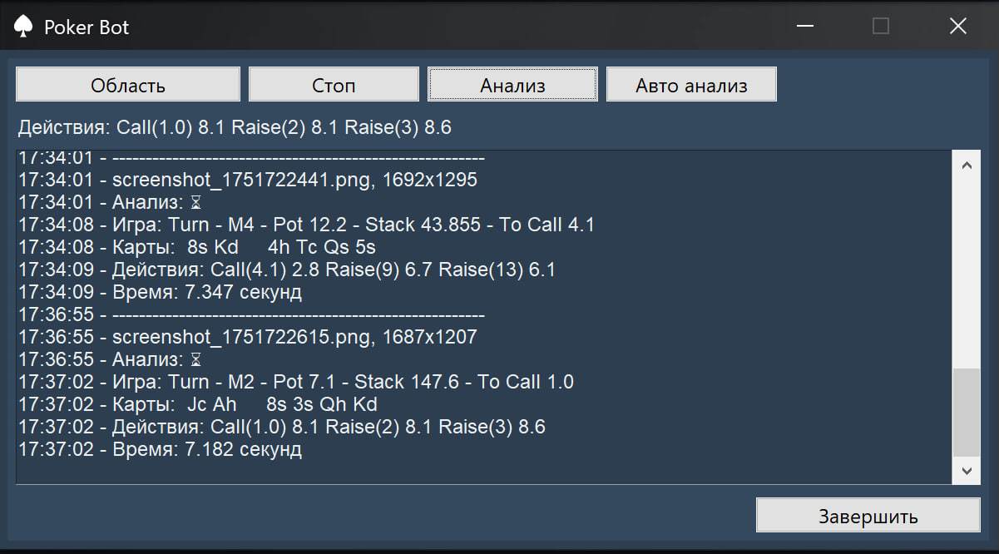

# Poker Bot

A poker assistant with a graphical interface in Python that calculates optimal actions based on mathematical equity and EV computations.

The project features a modular architecture separating poker logic, GUI, and computer vision.

---

##  Goals

1. Create a poker calculator
2. Provide real-time decision making
3. Implement an intuitive graphical interface
4. Use modular code structure
5. Integrate computer vision to recognize cards automatically

---

##  Tech Stack

- `Python`
- `tkinter` – GUI
- `treys` – poker hand evaluation
- `numpy` – math operations
- `pickle` – caching
- `YOLOv11n` – object detection

---

## 🧮 Poker Math

- Based on game theory and poker mathematics
- Monte Carlo simulation for equity evaluation
- `Equity`: chance to win a hand
- `EV`: expected value of an action
- `Pot odds`: ratio of pot to bet
- `Fold equity`: chance the opponent folds

---

## 🔍 YOLO Models

Using `YOLOv11n` (Nano):
**2,583,517 parameters**, **100 layers**, **6.4 GFLOPs**.

- **`totalpoker_yolo11n_200_768_40_0005.pt`**
  General object detection on the poker table.
  Trained on **200 images**, resolution **768**, **40 epochs**, `lr=0.005`.
  Quality: `mAP50-95 = 0.822`, `F1 confidence = 0.43`.

- **`pokercard_yolo11n_7598_768_80_001.pt`**
  Card detection model.
  Trained on **7k images**, resolution **768**, **80 epochs**, `lr=0.01`.
  Quality: `mAP50-95 = 0.866`, `F1 confidence = 0.55`.

---

## 📁 Project Structure

```
Project_09_Poker/
├── src/
│ ├── init.py
│ ├── gui/
│ │ └── gui.py                 # graphical interface
│ ├── pokerlogic/
│ │ ├── init.py
│ │ ├── best_action.py         # EV & action calculation logic
│ │ └── available_actions.py   # determine allowed actions
│ ├── cv/
│ │ ├── init.py
│ │ ├── detect.py              # YOLO detector
│ │ ├── ocr.py                 # text recognition
│ │ └── parser.py              # JSON extraction
│ └── config.py                # settings & constants
├── models/                    # YOLO weights
├── tests/                     # unit tests
├── app.py                     # entry point
├── .gitignore
├── LICENSE
├── requirements.txt
└── README.md
```

---

##  Interface



###  How to Run

1. Run `python app.py`
2. Or launch the executable `poker_bot.exe`
3. Select the poker table area
4. Click "Analyze" to calculate optimal action

###  System Requirements

- Windows 10/11
- 4GB RAM
- 100MB free disk space

---

##  Disclaimer

- This software is for **educational use only**
- The author is **not responsible** for any misuse or consequences

---

##  Author

(C) 2025 Goncharov Ivan
